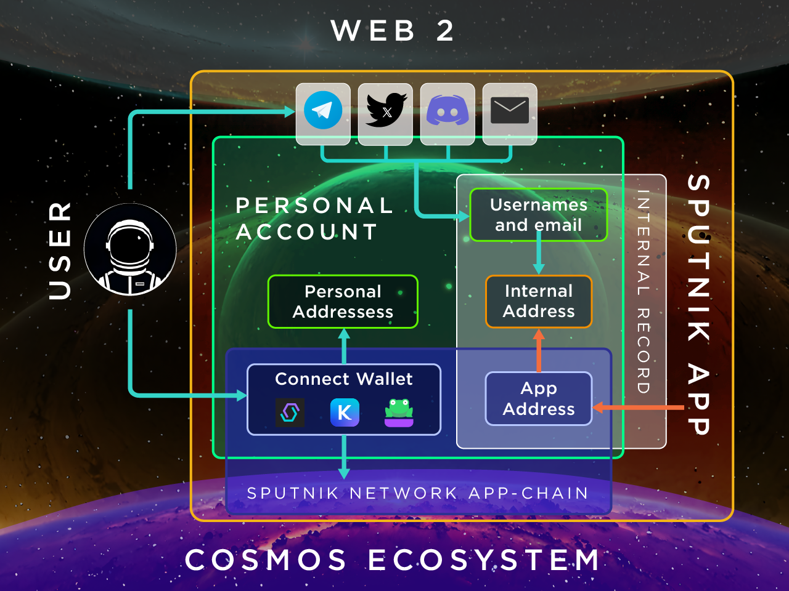

# Словарь Терминов и Схема

<figure><figcaption></figcaption></figure>

* [**Пользователь**](polzovatel.md)
* [**Web2**](web2.md)
* [**Web3**](web3.md)
* [**Крипто-кошелек**](kripto-koshelek.md)
* [**Экосистема Космос**](ekosistema-kosmos.md)
* [**Sputnik App**](sputnik-app.md)
* [**Sputnik Network App-chain**](sputnik-network-app-chain.md)
* [**Личный Кабинет**](lichnyi-kabinet.md)
* [**Адрес Приложения**](adres-prilozheniya.md)
* [**Внутрений Адрес**](vnutrennii-adres.md)
* [**Внутренняя Запись**](vnutrennyaya-zapis.md)
* [**Личный Адрес**](lichnyi-adres.md)
* [**Личный Sputnik-Адрес**](lichnyi-sputnik-adres.md)
