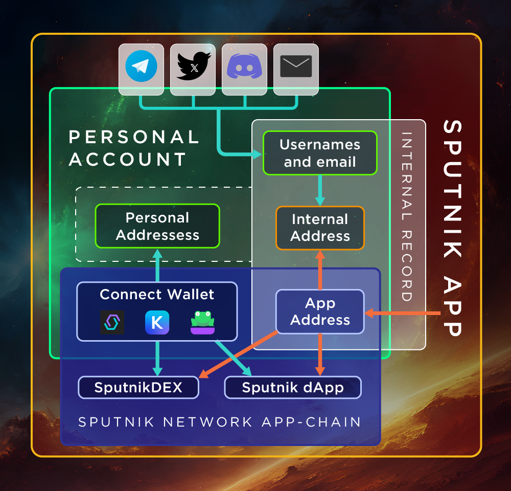

# Личный Кабинет

<figure><figcaption></figcaption></figure>

Через **Личный Кабинет**, [**Пользователь**](../slovar-terminov-i-skhema/polzovatel.md) взаимодействует с [**Sputnik App**](korotko-o-sputnik-app.md):

* **Личный Кабинет** отображает [**Пользователю**](../slovar-terminov-i-skhema/polzovatel.md) [**Web2**](pri-pervom-web2-podklyuchenii.md) и [**Web3**](pri-pervom-web3-podklyuchenii.md) подключения
* Каждый **Личный Кабинет** имеет свой [**Внутренний Адрес**](../slovar-terminov-i-skhema/vnutrennii-adres.md), который [**Sputnik App**](korotko-o-sputnik-app.md) используется для предоставления пользователю [**Web2-функционала**](web2-funkcional/)&#x20;
* Использование [**Внутренего Адреса**](../slovar-terminov-i-skhema/vnutrennii-adres.md) не является обязательным
* В **Личном Кабинете** пользователь может использовать [**Web2 (централизованный)**](web2-funkcional/) и [**Web3 (децентрализованный)**](web3-funkcional/) функционал
