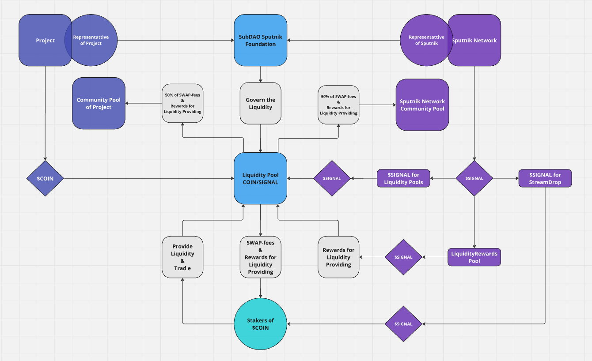

# Пулы Ликвидности

<mark style="color:red;">**!!! Это не финальная версия !!!**</mark>&#x20;

<mark style="color:red;">**!!! Все параметры и критерии могут быть изменены в любой момент, и более того, обязательно будут изменены во время тестнета !!!**</mark>&#x20;

<mark style="color:red;">**!!! Финальная версия токеномики и распределения будет утверждена после тестнета и перед запуском основной сети!!!**</mark>

Не более **150,000,000 $SIGNAL (\~14,64% от Общего Предложения)** будет направленно на создание [**Пулов Ликвидности**](puly-likvidnosti.md) в парах с $**SIGNAL**, как на [Sputnik DEX](../../../sputnik-network-app-chain/sputnik-dex.md), так и на других дружественных DEXах&#x20;

"**Изначальное Количество $SIGNAL в Пулах Ликвидности**" будет зависеть от [**Средней Цены $SIGNAL**](../../tokenomika-usdsignal/srednya-cena-usdsignal.md) и [**договорённости с проектами**](../strimdrop/steikery-proektov-kotorye-predostavyat-svoi-monety-dlya-sozdaniya-pulov-likvidnosti-v-pare-s-usdsign/formirovanie-spiska-setei-dlya-polucheniya-strimdropa-usdsignal.md)

* [**Osmosis**](https://app.osmosis.zone/)
* [**Astroport**](https://app.astroport.fi/)
* [**Dexter**](https://app.dexter.zone/)
* [**Source Swap**](https://www.sourceprotocol.io/)&#x20;
* [**Elys Network**](https://elys.network/)
* [**BeeZee DEX**](https://app.getbze.com/)
* [**Nolus Protocol**](https://nolus.io/)
* [**Helix**](https://helixapp.com/)
* [**White Whale**](https://app.whitewhale.money/)

<mark style="color:red;">**! Это не полный список децентрализованных бирж. Следите за обновлениями**</mark>

<figure><figcaption></figcaption></figure>

* Проектам из [Экосистемы Космос](../../../slovar-terminov-i-skhema/ekosistema-kosmos.md) будет предложено предоставить ликвидность собственных монет в паре с $**SIGNAL** на на **Sputnik DEX**, либо на любых других DEXах, по обоюдной договорённости&#x20;
* Количество монет от проекта будет пересчитано в **USDC** по рыночной цене в день предоставления ликвидности
* **Sputnik Network** пердоставит количество $**SIGNAL** в равном эквиваленте, исходя из [Cредней Цены $SIGNAL  ](../../tokenomika-usdsignal/srednya-cena-usdsignal.md)
* Весь не использованный $**SIGNAL** для создания [**Пулов Ликвидности**](puly-likvidnosti.md) будут направлены в [**Фонд Спутник**](../../../fond-sputnik.md)

За предоставление ликвидности  в своих монетах в паре с $**SIGNAL**, проекту будет предложено:

* &#x20;Направить одного (или несколько) представителей от проекта в [**Фонд Спутник**](../../../fond-sputnik.md) для коллективного децентрализованного управления ликвидностью, а так же защиты  интересов стейкеров монет проекта
* По стэйкерам монет проекта будет распределено количество $**SIGNAL** в два раза превышающее количество $**SIGNAL**, которое было предоставлено в пул ликвидности
* Награды за предоставление ликвидности будут поступать в **Пулы Сообщества Проекта** и в [**Пул Сообщества**](pul-soobshestva.md) Sputnik Network в равных пропорциях

## **Пример №1:**

_Если **Средняя Цена** $SIGNAL будет равно 0.1$, и **Astroport** предоставит $**ASTRO** в эквиваленте $**100,000 - Sputnik Network** предоставит **1,000,000** $**SIGNAL,** и на **Astroport** будет создан пул **ASTRO/SIGNAL**, и_ _кроме этого, на **Astroport** будет размещено ещё несколько пулов ликвидности в паре с $**SIGNAL** с ликвидностью не менее чем  $**100,000**_

_Поставщики ликвидности в парах с $**ASTRO** разделят **СтримДроп** в **2,000,000** $**SIGNAL**_

_**50**%_ _наград за предосставление ликвидности, а также **50**% комиссий за обмен, будет поступать в трэжери **Astroport**, а другие **50**% будут направлены в трэжери_ [_**Фонда Спутник**_](../../../fond-sputnik.md)

_Представитель **Astroport** войдёт в состав_ [_**Фонда Спутник**_](../../../fond-sputnik.md)

## **Пример №2:**

_Если **Средняя Цена** $SIGNAL будет равно 0.2$, и **Elys Network** предоставит $**ELYS** в эквиваленте $5**0,000 - Sputnik Network** предоставит **250,000** $**SIGNAL,** и на **Elys Network** будет создан пул **ELYS/SIGNAL**, и_ _кроме этого, на **Elys Network** будет размещено ещё несколько пулов ликвидности в паре с $**SIGNAL** с ликвидностью не менее чем $**50,000**_

_Поставщики ликвидности в парах с $**ELYS** разделят **СтримДроп** в **500,000** $**SIGNAL**_

_**50**%_ _наград за предосставление ликвидности, а также **50**% комиссий за обмен, будет поступать в пул сообщества **Elys Network**, а другие **50**% будут направлены в трэжери_ [_**Фонда Спутник**_](../../../fond-sputnik.md)

_Представитель **Elys Network** войдёт в состав_ [_**Фонда Спутник**_](../../../fond-sputnik.md)

Более подробно в разделе [**Токеномика $SIGNAL**](../../tokenomika-usdsignal/)
